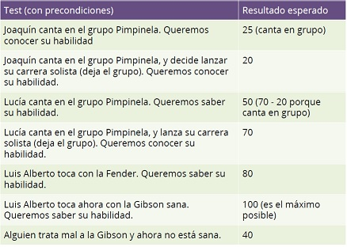
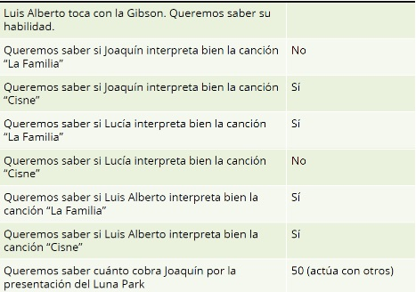
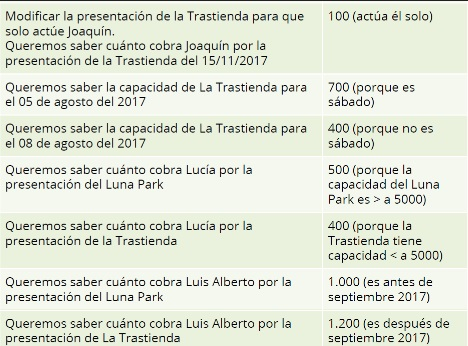

# Music Guide
## Primera iteración
Como el mundo de la música es muy complejo, los músicos propusieron hacer un sistema para poder ayudarlos en el día a día de sus carreras. 

En principio queremos resolver tres requerimientos:
* saber la habilidad de un músico
* saber si un músico puede ejecutar bien una canción
* saber el costo de una presentación

Algunos músicos que queremos modelar:

### Joaquín
* pertenece al grupo “Pimpinela”
* su habilidad es 20 pero le suma 5 puntos si canta/toca en grupo
* interpreta bien las canciones que duran más de 300 segundos
* cobra 100 pesos por presentación si toca él solo, o 50 en caso contrario

### Lucía
* pertenece al grupo “Pimpinela”
* su habilidad es 70
   * si canta en grupo se le resta 20 la habilidad.
* interpreta bien una canción que diga la palabra “familia” (sin importar mayúsculas o minúsculas)
* cobra 500 pesos la presentación si es en un lugar concurrido (cuya capacidad es mayor a 5.000 personas) o 400 en caso contrario

### Luis Alberto
* tiene una guitarra Fender que vale 10 UG[1], pero a veces toca con una Gibson que vale 15 si está sana o 5 si la rompieron (por supuesto eso depende de cómo la traten, pero sale de fábrica sanita).
* su habilidad es de 8 * el valor de la guitarra hasta un máximo de 100
* interpreta bien todas las canciones
* cobra 1.000 pesos por presentación hasta septiembre del 2017, después cobra $ 1.200

Conocemos estas canciones:
* “Cisne”, que dura 312 segundos, que tiene como letra “Hoy el viento se abrió quedó vacío el aire una vez más y el manantial brotó y nadie está aquí y puedo ver que solo estallan las hojas al brillar”
* “La Familia”, que dura 264 segundos y tiene como letra “Quiero brindar por mi gente sencilla, por el amor brindo por la familia“

Contamos con las siguientes presentaciones:
* el 20/04/2017, en “Luna Park”, donde van a estar Luis Alberto, Joaquín y Lucía
* el 15/11/2017, en “La Trastienda”, donde van a estar Luis Alberto, Joaquín y Lucía

La capacidad del “Luna Park” se estima en 9.290 personas para cualquier día, mientras que la Trastienda tiene capacidad para 400 en planta baja y 300 en el primer piso (lo habilitan los sábados únicamente).
El costo debe calcular la sumatoria del cachet que cobra cada músico por hacer esa presentación (considerando el criterio que tiene cada músico para cobrar una presentación).

## Casos de prueba a implementar

## Segunda iteración

La aplicación resultó un verdadero suceso, y detrás de las palmadas en el hombro vienen nuevos requerimientos.

### Músicos
Al empezar a relevar otros músicos locales, se detectó que Joaquín y Lucía no diferían mucho del comportamiento general de dos estilos de músico:
* Joaquín representa al músico “de grupo”
   * como plus, queremos parametrizar lo que aumenta el músico por tocar en grupo, ya que no todos aumentan la misma cantidad
* Lucía representa al vocalista popular
   * como plus, el usuario nos pidió que se pueda parametrizar la palabra que haga que interprete bien una canción

Lo que nos pide el usuario es que cada músico pueda definir
* su propia habilidad
* si es solista o toca en algún grupo
* los álbumes que publicó

Más allá de eso el comportamiento debe ser el mismo para todos estos músicos. Para esta entrega queremos agregar entonces a
* Kike, que es un músico de grupo, con habilidad 60 y un plus de 20 por cantar en grupo
* Soledad, que es una vocalista popular, con habilidad 55 y “amor” como palabra que hace que cante bien.

Luis Alberto, por si no lo notaron, es único e irrepetible, pero también comparte con los demás músicos en que
* tiene una habilidad: la base es 8 a la que le sigue multiplicando el valor del instrumento hasta un máximo de 100 (no varió la definición de negocio de la entrega 1, quizás sí varíe la forma de implementarlo)
* sabemos si toca en grupo o no
* y sabemos los álbumes que editó (ver a continuación)

El concepto de álbum agrupa una serie de canciones y tiene un título propio, que no necesariamente es el de alguno de los temas, como en el caso de “Cómo conseguir chicas” de Charly García. También conocemos la fecha de lanzamiento, cuántas unidades salieron a la venta y cuántas efectivamente se vendieron.

### Canciones
Sabemos que todas las canciones comparten la misma estructura
* el título principal
* la letra
* la duración (en segundos)

### Nuevas funcionalidades
El usuario nos pidió incorporar estos requerimientos:
1. Saber si un músico es minimalista, esto ocurre cuando todas sus canciones (las de todos sus álbumes) son cortas (menos de 3 minutos)
2. Saber qué canciones de un músico tienen alguna palabra, por ejemplo: para Luis Alberto la palabra “cielo” aparece en “Alma de diamante” y “Crisantemo”.
3. Saber cuántos segundos dura la obra de un músico, es decir cuánto suman todas las canciones de sus álbumes.
4. Saber cuál es la canción más larga de un álbum (en base a la letra registrada de la canción).
5. Saber si un músico la “pegó”, esto ocurre cuando todos sus álbumes tienen buenas ventas (más del 75% de los ejemplares que se lanzaron fueron vendidos)

### Fixture
Respecto a las nuevas relaciones:
* Joaquín editó álbum “Especial La Familia” el 17/06/1992, que sacó 100.000 copias y vendió 89.000
   * Tiene solo un single: “La Familia”, cuya letra es “Quiero brindar por mi gente sencilla, por el amor brindo por la familia“ y cuya duración es 264 segundos.
* Kike y Lucía no editaron álbumes.
* Soledad compuso un álbum “La Sole” el 04/02/2005, que sacó 200.000 copias y vendió 130.000, con dos canciones
   * “Eres”, que dura 145 segundos y cuya letra es “Eres lo mejor que me pasó en la vida, no tengo duda, no habrá más nada después de ti. Eres lo que le dio brillo al día a día, y así será por siempre, no cambiará, hasta el final de mis días.”
   * “Corazón Americano”, que dura 154 segundos y cuya letra es “Canta corazón, canta más alto, que tu pena al fin se va marchando, el nuevo milenio ha de encontrarnos, junto corazón, como soñamos.”
* Luis Alberto editó 2 álbumes
   * El primero se llama “Para los árboles”, lanzado el 31/03/2003, sacó 50.000 copias y vendió 49.000, consta de dos canciones:
      * “Cisne”, de 312 segundos, cuya letra es “Hoy el viento se abrió quedó vacío el aire una vez más y el manantial brotó y nadie está aquí y puedo ver que solo estallan las hojas al brillar”
      * “Alma de diamante”, de 216 segundos, cuya letra es “Ven a mí con tu dulce luz alma de diamante. Y aunque el sol se nuble después sos alma de diamante. Cielo o piel silencio o verdad sos alma de diamante. Por eso ven así con la humanidad alma de diamante”
   * El segundo se llama “Just Crisantemo”, lanzado el 05/12/2007, sacó 28.000 copias y vendió 27.500. Tiene un solo tema:
      * “Crisantemo”, de 175 segundos, cuya letra es “Tócame junto a esta pared, yo quede por aquí... cuando no hubo más luz... quiero mirar a través de mi piel... Crisantemo, que se abrió... encuentra el camino hacia el cielo”

## Tercera iteración
¡Va queriendo! Ahora nos acercaron nuevos requerimientos

### Criterios para comparar canciones
Queremos comparar canciones
* por duración
* por tamaño de la letra
* y por título

De esta manera podemos agregar una nueva funcionalidad: saber cuál es la mayor canción de un álbum según un criterio que compare dos canciones. No se pide que elimine la funcionalidad anterior, pero sí que aplique algún mecanismo de reutilización que evite repetir la misma idea dos veces.

### Nuevas canciones
Queremos establecer nuevos tipos diferentes de canciones:
* los remixes refieren a una canción original, y duran el triple de lo que dura dicha canción. La letra toma la letra de la canción original y agrega  “mueve tu cuelpo baby ” al principio y “ yeah oh yeah” al final.
* los mashups mezclan dos o más canciones, y su duración es la del tema más largo (en segundos de duración). La letra sale de concatenar las letras de cada canción que interviene (intercalando entre ellas un espacio pero borrando los espacios que haya al comienzo y al final). La letra es la concatenación de todas las letras. El mashup de “Crisantemo” y “Alma de Diamante” es distinto del mashup que forman “Alma de Diamante” y “Crisantemo”

### Cambios en los músicos
Después de un relevamiento más exhaustivo, el usuario necesita hacer un cambio en el requerimiento que define cuándo un músico ejecuta bien una canción.
* Todos los músicos interpretan bien las canciones de su autoría
* Todos los músicos con habilidad mayor a 60 ejecutan bien cualquier canción
* Además debemos considerar las definiciones específicas para cada músico en particular
   * los músicos “de grupo” cantan bien las canciones que duran más de 300 segundos
   * los vocalistas populares cantan bien una canción que diga una determinada palabra (sin importar mayúsculas o minúsculas)

Con que alguna de las condiciones se cumpla se considera que dicho músico interpreta bien esa canción. No debe repetir ideas en la implementación de dicho requerimiento.

### Pdpalooza
Queremos generar una presentación en el estadio Luna Park el día 15/12/2017. Para eso
* no aceptamos ningún músico de habilidad menor a 70
* tampoco aceptamos músicos que no hayan compuesto al menos una canción
* y tampoco aceptamos músicos que no puedan ejecutar la canción “Canción de Alicia en el país” que dura 510 segundos y tiene como letra “Quién sabe Alicia, este país no estuvo hecho porque sí. Te vas a ir, vas a salir pero te quedas, ¿dónde más vas a ir? Y es que aquí, sabes el trabalenguas, trabalenguas, el asesino te asesina, y es mucho para ti. Se acabó ese juego que te hacía feliz.” 

Resolver este requerimiento teniendo en cuenta 
* que al querer agregar un músico debe verificarse que cumpla todas las condiciones
* que es importante para el usuario entender el motivo por el cual no pueda agregar un músico.
* como punto BONUS se valorará la posibilidad de poder agregar o quitar restricciones respecto a los músicos. Por ejemplo, para traer músicos menos habilidosos, podríamos eliminar la restricción de tener músicos de habilidad mayor o igual a 70 y crear una restricción para que los músicos tengan una habilidad mayor o igual a 50. Lo mismo con las demás restricciones.

## Cuarta iteración
Y para cerrar los requisitos de este año, el usuario nos pide las últimas modificaciones.

### Los músicos y su complejidad
Después de un cierto tiempo el usuario comenzó a tener problemas ya que muchos músicos comenzaban cobrando de una forma y luego pasaban a otra, sumado esto a que algunos no interpretaban bien una canción primero pero luego sí. Entonces decidió modificar las categorías de los músicos:
* sigue siendo cierto que todos los músicos cantan bien una canción si su habilidad es > 60 o bien si la canción es de su autoría, pero además debemos considerar
* algunos músicos cantan bien canciones que tienen una determinada palabra en su letra, son los palabreros
* otros músicos cantan bien canciones de más de x segundos (se quiere parametrizar ese x): son los largueros
* y ahora también hay otros músicos que cantan bien canciones que tienen una cantidad impar de segundos: son los impareros
* no entra en el juego Luis Alberto, que sigue siendo único e irrepetible
* además algunos músicos cobran una cierta plata para un recital donde cantan ellos solos o bien la mitad en caso contrario, es decir que cobran en base a cuántos se presentan en el show.
* otros músicos cobran una cantidad x de pesos si la capacidad del lugar es de más de p personas, y de lo contrario cobran 100 pesos menos, es decir cobran en base a la capacidad del lugar.
* y por último están los que cobran x pesos hasta una fecha f y pasada esa fecha cobran un porcentaje adicional p, es decir que cobran en base a la expectativa inflacionaria.
* la lógica de negocio para calcular la habilidad sigue siendo la misma para luis alberto, los vocalistas populares y los músicos de grupo

Nuestro administrador de la aplicación quiere poder modificar y combinar
1. las formas de cobrar un músico y 
2. la forma de definir si pueden ejecutar una canción en forma adecuada, 
de manera que sea fácil cambiar un músico que cobra por capacidad y es larguero, a un músico que cobre en base a la inflación y que sea palabrero.

Diseñar e implementar una solución evitando no solo la repetición de ideas y código, sino también pensando en facilitar la creación de un músico en el fixture. 

### ¡Vamos las bandas!
El concepto de banda o grupo musical se hizo más fuerte, y el usuario nos pidió incluir a la banda para convocarlas a recitales y para saber también qué discos editaron. Una banda tiene un conjunto de músicos que además pueden haber hecho una carrera solista, con sus propios álbumes publicados.

Esto no afecta la definición anterior del músico que sabe si es solista o no.

Del relevamiento con el usuario surgieron las siguientes conclusiones:
* además de los músicos, una banda necesita un representante, que no tiene habilidades pero sí cobra un monto en pesos por presentación
* la habilidad de una banda es la suma de habilidades de sus músicos (considerar que van a tocar en grupo) más un 10% por la “química”
* una banda cobra la sumatoria de lo que cobran todos más lo que cobra el representante
* una banda puede tocar una canción si todos los integrantes la pueden tocar

### Requerimientos adicionales
* Dada una lista de canciones, queremos saber cuáles puede tocar bien un músico
* Conocer cuál es la “magia” de una presentación, que es la suma de habilidades de los músicos que tocan en ese show (para las bandas vale la habilidad de la banda)

### Fixture
Nuevos lugares para tocar:
* Prix D’Ami es para 150 personas
* La Cueva es para 14.000 personas

Cambios en los músicos
* Joaquín es larguero de 300 segundos y cobra por tocar él solo en un show  $ 100 (o la mitad en caso contrario). Sigue perteneciendo al grupo “Pimpinela”.
* Lucía es palabrera de “familia” y cobra por capacidad (a partir de 5000) $ 500 (o el descuento). Sigue perteneciendo al grupo “Pimpinela”.
* Soledad es palabrera de “amor” y cobra por tocar ella sola en un show $ 6000 (o la mitad en caso contrario)
* Kike es imparero y cobra por expectativa inflacionaria una base $ 4000 y un 50% más a partir del 8 enero del 2018
* Recordemos que Luis Alberto cobra 1.000 pesos por presentación hasta septiembre del 2017, después cobra $ 1.200 (o sea un 20%)

Aparecen dos bandas:
* “Pimpisole”, compuesta por Soledad, Joaquín y Lucía.
   * Tiene un representante: “Cachorro” que cobra $ 1.982
* “El eterno retorno”, compuesta por Kike y Luis Alberto
   * Tiene un representante “Félix” que cobra 500

Luis Alberto toca con la Fender por defecto.

Incorporar nuevas presentaciones:
* “Prix D’Ami”, para el 30/06/2017, donde van a tocar Joaquín, Soledad y “El eterno retorno”. 
* “La Cueva”, para el 05/01/2018, donde va a tocar Pimpisole.
